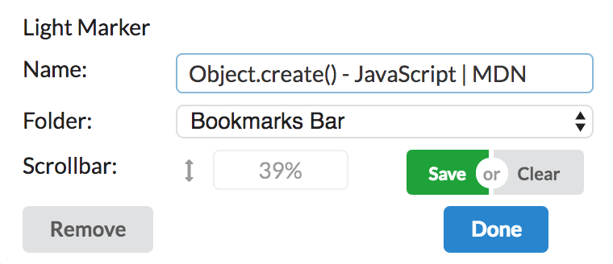

  

# Light Marker ⚡

A lightweight, non-intrusive bookmark Chrome Extension to save your scrollbar position, in order to remember your reading locations and restore it when you open next time. 😮

  

## How to use 🤔

Simply install it and click it. Light Marker is meant to be a lightweight overlay on top of Chrome's default bookmark. It saves bookmark exactly the same as Chrome's own bookmark. Even you uninstall Light Marker, you easily fall back to the default one, without lossing any bookmakrs (but you lose scrollbar positions).

Just remember to click the `save` button to save the scrollbar location. Next time when you open this page, it automatically jumps to this location, so you're back to where you left!

## Bugs and feature requests 🤪

Please submit issues for reporting bugs 🐞, feature requests 💡 or any thoughts 😘 !

## Credit

Light Marker icons made by [Smashicons](https://smashicons.com/) from [www.flaticon.com]().